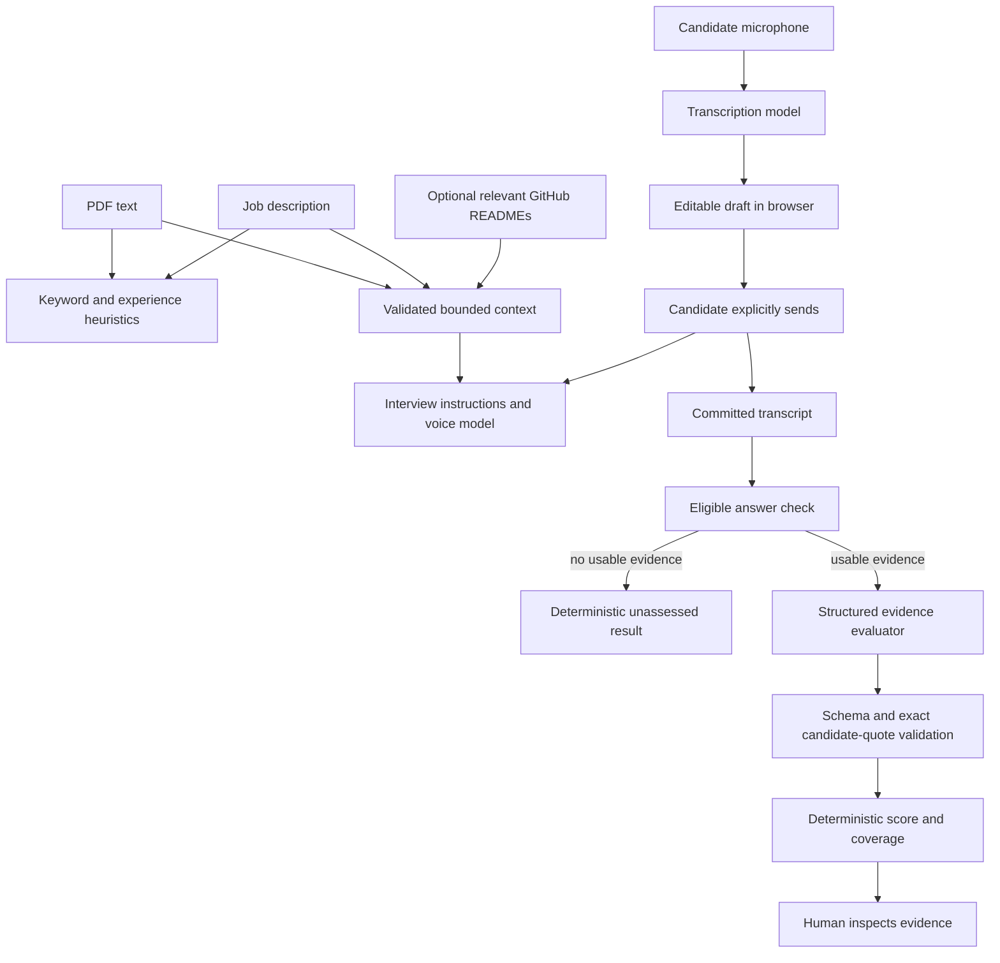

# InterviewMate — from CV intake to reviewable interview evidence

Case study, MVP product requirements and engineering handoff · 2026-09-11

[Working prototype](https://interviewmate-ai.shiverion.com/) · [MVP audit](mvp-readiness-audit.md) · [Demo script](demo-script.md) · [Release evidence](../docs/hr-product-sprint/evaluation/results/2026-09-11-production-release.md)

**Status:** deployed prototype accepted by its builder for demonstration. This is the current submission document. It supersedes the earlier PDF/JSON case-study draft, which describes old models and pre-release blockers. Video recording and portal submission are not complete. Manual baseline timing is not measured.

## 1. Problem and user

A tech recruiter needs to turn CVs and first-screen answers into a concise, job-specific record for a hiring manager. Separate resume checks, invitation setup, transcripts and assessment notes make the handoff fragmented. The recruiter must still inspect what a candidate actually demonstrated and identify unanswered areas.

The initial sprint focused on the transcript-to-brief bottleneck. The owner's later workflow requirements extended it upstream: upload a batch of CVs, inspect an ATS ranking, choose candidates and prepare interview links from the extracted identities. The evidence review remains the downstream purpose of that automation.

**Primary user:** recruiter managing the first-screen workflow for a technical vacancy. **Secondary user:** hiring manager inspecting the resulting evidence. **Affected user:** candidate who needs understandable questions, a chance to correct transcription, and a clear completion/evaluation experience.

The user problem is a desk-research hypothesis. No recruiter or hiring-manager interview was available. [Discovery](../docs/hr-product-sprint/research/problem-and-workflow.md) and the [source register](../docs/hr-product-sprint/research/source-register.md) preserve the basis and limits. We do not claim observed applicant volumes, customer demand or time savings.

The intended success metric is active minutes to a reviewed first-screen brief, with unsupported claims, missing evidence and corrections recorded alongside time. Its before/after numerical baseline is not measured. The [audit](mvp-readiness-audit.md#smallest-way-to-close-the-baseline-gap) provides a small builder measurement protocol.

## 2. Product decision and sprint contribution

We reused an existing Next.js InterviewMate app with interview, authentication and resume-check foundations. Reuse allowed the sprint to focus on the recruiting workflow and AI behavior. This is an extension of an inherited product, not a claim that the full application was written in five days; actual working hours were not logged.

The delivered changes connect batch CV screening to invitation setup and interview history; combine voice with an editable draft and explicit Send; present evidence levels with exact candidate quotations; separate reviewer tests from production records; and add session recovery, feedback and deployed access controls. The [inherited source baseline](../docs/hr-product-sprint/evaluation/current-product-baseline.md) and phase reports provide the history.

### MVP requirements and acceptance

| ID | Requirement | Observable acceptance |
|---|---|---|
| R1 | One role brief for a CV batch | Role/JD is entered once and used for each CV score |
| R2 | Parse and rank CVs | Up to 50 PDF inputs produce parsed text or a visible failure; name/email are editable and successful rows show ATS scores |
| R3 | Recruiter controls invitation selection | Top 5/10/20 is optional; manual checkbox changes determine who receives a generated link |
| R4 | Separate schedule page | Steps 1–3 remain visible, including the empty ranking state; Step 4 opens `/pipeline/schedule` with selected candidates |
| R5 | Snapshot invitation context | Link creation records identity, validity window, role/settings, CV context and available ATS result |
| R6 | Candidate-only interview journey | Invited candidate can enter the permitted session, answer, view the allowed evaluation and leave feedback |
| R7 | Voice and editable text together | Speech becomes a draft; only explicit Send submits the answer; draft clears after submission; interviewer speech completes before the next answer |
| R8 | Grounded evidence assessment | Report shows candidate quotes and competency levels; invalid provider output is an error, not a fabricated successful assessment |
| R9 | Reviewable history | ATS, assessment and timestamps remain inspectable on the session detail page in the same browser tab |
| R10 | Separate test and production surfaces | `/reviewer-tests` and `/invitations` are secondary routes; primary history excludes reviewer tests |
| R11 | Recovery and completion | Candidate sees interruption warnings/recovery or termination state; completion waits for closing behavior and offers the finish/countdown flow |
| R12 | Feedback without affecting assessment | Five 1–5 experience metrics plus optional note; failed workspace sync is disclosed and a local copy can remain |

These are the implemented product acceptance criteria, supported by the release checks and builder walkthrough. They are not independently executed pass counts for every browser/provider combination.

**Out of scope:** automatic rejection/hiring, automatic email delivery, ATS/HRIS integration, OCR, custom model training, covert app monitoring, eye tracking, a separate Figma app and a large multi-model tournament.

## 3. UX and workflow

The prior workflow was role definition → separate CV review → individual interview setup → interview → manual reconstruction of feedback. The MVP connects these stages while keeping recruiter selection explicit.

```mermaid
flowchart LR
  A[Role brief] --> B[Batch CV PDFs]
  B --> C[Parse names, emails and text]
  C --> D[Deterministic ATS ranking]
  D --> E[Recruiter reviews and selects]
  E --> F[Interview settings and link window]
  F --> G[Create and copy invitation links]
  G --> H[Candidate admission and setup]
  H --> I[AI question and speech]
  I --> J[Candidate speaks or types]
  J --> K[Review transcript draft and Send]
  K --> I
  K --> L[Closing and completion]
  L --> M[Evidence assessment and feedback]
  M --> N[Recruiter history and detail record]
```



| Surface | Purpose and important states |
|---|---|
| `/pipeline` | Role, uploads, visible Step 3 empty state, per-file processing/error, ranking and selection |
| `/pipeline/schedule` | Selected identities, shared interview settings, validity and generated links; creation errors remain actionable |
| `/apply/{sessionId}` | Admission for the invited email and session window; denied/expired access must not open another session |
| `/interview` | Interviewer playback, bounded scrolling transcript, editable answer draft, Send, timer and recovery/completion state |
| `/interviews` and `/interviews/{sessionId}` | Production history with ATS/evidence/timestamps and full detail page; missing or pending assessments remain distinguishable |
| `/candidates` | Minimal candidate list with expandable screening/session information |
| `/feedback` | Admin inspection of experience ratings, separate from evidence scores |
| `/reviewer` | Private sponsored reviewer setup → interview → evaluation → feedback |
| `/reviewer-tests`, `/invitations` | Secondary testing/admin routes, not primary recruiter navigation |
| `/demo`, `/settings`, `/ats-check` | Public demo entry, provider configuration where permitted, and standalone resume check |

English is the target demonstration language; Bahasa Indonesia is the multilingual extension. Language selection controls speech/transcription instructions. Auto-detect is a separate configuration, not a claim of perfect recognition.

## 4. AI logic and scoring

### Boundaries between deterministic logic and model output



This is the behavior specification for the selected web-app deliverable. Transcription, conversation and evaluation have distinct responsibilities; this does not require a separate prompt-chaining product.

The release configuration records `gpt-realtime-2.1-mini` for voice, `gpt-transcribe` for transcription, and `gpt-5.6-luna` for evaluation. Low reasoning is the default, with supported Medium settings available. These are configured identifiers in this release, not a current market comparison. Gemini/DeepSeek adapters exist, but the recorded hosted smoke used OpenAI; an optional adapter is not a tested winner.

### ATS score

The [ATS route](../src/app/api/ats-score/route.ts) uses deterministic text matching, not an LLM:

`overall_match = round(0.40 × keyword_match + 0.35 × skills_coverage + 0.25 × experience_alignment)`

Each input component is on a 0–100 scale. Matching terms, missing terms, summary and heuristic flags accompany the score. The experience component uses coarse wording/seniority signals. Keyword wording, CV formatting and title language can affect it; the score is not verified job suitability, language-neutral matching or a validated probability of success. Recruiters can inspect it and override Top-N selection.

### Interview and transcript behavior

The [shared configuration](../src/lib/interview/config.ts) holds language, duration, turn budget, approach, optional rubric, questions and technical panels. Role and validated CV context inform questions when custom questions are empty. Optional GitHub retrieval gives bounded context; a repository mention does not verify authorship. A short turn budget limits coverage, so a session is not guaranteed to ask about every CV item or repository.

[Realtime instructions](../src/lib/realtime/service.ts), [turn policy](../src/lib/interview/turn-policy.ts) and the [interview store](../src/lib/store/useInterviewStore.ts) coordinate opening, explicit answer submission, repeats, follow-ups, recovery and closing. Prompt instructions request no duplicate greeting, unnecessary thinking narration or repeated answered detail. Those behaviors still depend partly on model compliance; observed failures belong in the review log.

### Evidence evaluation

The [assessment orchestrator](../src/lib/ai/assess.ts) passes bounded role/CV context, configured rubric and indexed transcript lines to the provider. The [evidence prompt and validator](../src/lib/ai/evidence.ts) request levels 0–4 with exact candidate quotations and 1-based turn references. Interviewer wording, filler, skipped and technical-failure turns are not candidate competency evidence. Transcript instructions are treated as untrusted content.

The server validates the structure and candidate quote references, then computes display dimensions. An exact quotation can still be assigned an inappropriate interpretation; mechanical validation does not establish semantic correctness.

- **Evidence level:** 0 = no evidence, 1 = weak/vague, 2 = partial, 3 = clear, 4 = strong/concrete.
- **Displayed evidence score:** `round(sum(levels) / (4 × total competencies) × 100)` when competencies exist. Missing evidence contributes zero to this aggregate; it is not a separately imposed penalty.
- **Average evidence level:** average of assessed levels only, reported out of 4. Unassessed competencies do not lower this assessed-only average.
- **Coverage:** assessed competencies / total competencies. No derived/configured competencies can produce no score; an existing rubric with no eligible evidence can produce 0/100 with unassessed status.
- **Interpretation:** the display measures supported interview evidence under this rubric, not hiring probability or candidate capability. Different generated rubrics and different coverage make cross-candidate percentages imperfect comparisons.

The legacy `overallScore` hiring field stays null in the current evidence result. `dimensions.evidenceScore` is the displayed percentage. Engineers should not use the older `evaluation-schema.ts` hiring-recommendation schema as the current evidence contract.

The optional additional rubric defaults empty. Inspect the implementation when changing its semantics: the current evidence prompt restricts output to supplied competencies when a rubric is provided. It should not be documented as always adding those items to a separately generated base rubric.

## 5. Evaluation: inputs, results and iterations

| Evidence source | What exists | What it supports |
|---|---|---|
| Authored HR transcripts | [Eight base cases and two variants](../docs/hr-product-sprint/evaluation/dataset/README.md), covering concrete/vague/missing/conflicting evidence, unknown speakers, injection, cautious wording and interruption | Reproducible inputs and provisional references; not calibrated hiring labels |
| CV/JD fixture | [Ten fictional CVs](../docs/hr-product-sprint/evaluation/dataset/cv-pipeline-v1/README.md), distinct names/emails and intended strong/partial/unrelated groups | Batch parsing, ranking inspection and invitation test material |
| Archived live benchmark | First frozen batch stopped at provider failure | Honest failure evidence; not a completed model comparison |
| Builder live testing | Owner acted as candidate/reviewer, supplied Indonesian transcript examples, reported bugs and accepted the revised flow | Single-builder qualitative product validation; not inter-rater reliability |
| Release checks | [191 tests / 25 suites, TypeScript/build and CI pass, production smoke](../docs/hr-product-sprint/evaluation/results/2026-09-11-production-release.md) | Software/integration evidence at the recorded release; mocked tests do not measure model accuracy |
| Seeded dashboard records | Fictional completed interviews and feedback used for demonstration | Presentation fixtures only; not real applicant outcomes or a satisfaction survey |

The fixture data was authored for this project. No completed evaluation on an imported public HR dataset and no model training run is documented. English remains the intended baseline; no WER, latency distribution or independent English grading agreement is claimed.

### Builder-observed failures and resulting changes

| Observation reported during testing | Change made through the iteration | Evidence limit |
|---|---|---|
| Speech drafts reset/duplicated; noise or fillers advanced the interviewer | Editable draft plus explicit Send, transcript accumulation/deduplication and playback protection | Builder later accepted the interaction; no measured transcription error rate |
| Duplicate opening, spoken thinking filler, closing cut off | Opening/response coordination, instruction refinement, closing and finish/countdown control | User-reported improvement; probabilistic model behavior still needs observation |
| Transcript/footer overlap and oversized panels | Scrolling transcript and page spacing/layout adjustments | Qualitative desktop feedback; not a full accessibility audit |
| Evaluation pending despite a visible score; feedback permission/sync errors | Report/evaluation persistence, provider selection and feedback handling revisions | Builder acceptance and regression evidence; no fleet-wide reliability metric |
| Invitation creation failed on Vercel filesystem | Firestore-backed hosted ledger and stable secret configuration | Deployment/integration evidence in the release record |

No measured recruiter time saving, model accuracy percentage, bias reduction or cost advantage is claimed. The narrow manual-versus-assisted baseline remains the explicit D1/D4 evidence gap. That requires measuring human work; more app features do not close it.

## 6. Engineering handoff

### Source map and ownership

| Concern | Current source |
|---|---|
| Pipeline and schedule screens | [Pipeline](<../src/app/(recruiter)/pipeline/page.tsx>), [schedule](<../src/app/(recruiter)/pipeline/schedule/page.tsx>) |
| Parse and ATS boundary | [PDF result contract](../src/lib/pdf/result.ts), [ATS route](../src/app/api/ats-score/route.ts) |
| Session creation / snapshots | [Firebase interviews](../src/lib/firebase/interviews.ts) |
| Voice and turn state | [Realtime service](../src/lib/realtime/service.ts), [interview store](../src/lib/store/useInterviewStore.ts), [configuration](../src/lib/interview/config.ts) |
| Evidence request / provider / validation | [Evaluate API](../src/app/api/evaluate/route.ts), [assess](../src/lib/ai/assess.ts), [provider adapter](../src/lib/ai/evaluation.ts), [evidence contract](../src/lib/ai/evidence.ts) |
| Report rendering | [Evidence assessment](../src/components/interview/EvidenceAssessment.tsx) |
| Admission and database policy | [Access helper](../src/lib/firebase/access.ts), [Firestore rules](../firestore.rules), [Storage rules](../storage.rules) |
| Hosted state | [Reviewer access](../src/lib/access/reviewer.ts), [ledger](../src/lib/demo/ledger.ts), [Admin SDK](../src/lib/firebase/admin.ts) |
| Experience feedback | [Feedback form](../src/components/interview/InterviewFeedbackForm.tsx), [admin view](<../src/app/(recruiter)/feedback/page.tsx>) |

### API example and error contract

This is an **illustrative request**, not a recorded model result, for `/api/evaluate`:

```json
{
  "sessionId": "illustrative-session",
  "role": "Frontend engineer: React, API integration and testing",
  "cv": "Validated text from a fictional resume",
  "transcript": [
    { "role": "assistant", "text": "What did you personally implement?" },
    { "role": "user", "text": "I implemented the React filters and wrote tests for empty results." }
  ]
}
```

An optional `configuration` must match the shared schema. The result envelope contains `success`, `evaluation`, `provider`, `model`, `diagnostic`, `persisted` and `source`. This route currently returns `persisted: false`; successful generation is distinct from saving the session. Callers must check the appropriate persistence result before showing a saved state. Hosted demo/reviewer endpoints also perform their own admission and ledger operations.

This route bounds the request at 150 KB, transcript at 100 lines / 5,000 characters per line, role at 6,500 and CV at 24,000 characters. Invalid origin is 403, unknown provider is 400, and validation/provider failures are returned as 422 by this route. Error text does not create a valid score. Provider fallback uses configured permitted credentials; it must record the model that actually returned the output. Do not count fallback output as evidence about the failed primary model.

### Persistence and access

`pipeline_candidates` holds screened identity/ATS metadata. `interview_templates` and `interview_sessions` hold role/configuration snapshots, identity, session status, ATS, transcripts and evaluation fields. The invited production CV can be stored under a scoped Firebase Storage path; public/personal demo context uses the relevant browser-local flow. Reviewer records are distinguished by `record_kind: reviewer_test` or `source: reviewer_invitation`; history filters must preserve that separation.

Feedback is attached as `candidate_feedback` on relevant session records, with a separate reviewer ledger path supported by the feedback form. Product feedback ratings must not change competency evidence. A local success with failed workspace sync must remain distinguishable from a confirmed server save.

Production hosted usage/invitations use Admin SDK Firestore transactions. The current ledger stores its state in one document: adequate for this prototype's bounded usage, but subject to document-size/contention limits. Local development/tests retain a file-backed fallback. Do not restore filesystem writes under Vercel `/var/task`.

The shipped UI exposes the recruiter workspace to authorized admin accounts; ordinary users see the public overview/demo/resume-check surfaces. Database rules also express creator and invited-candidate access. UI hiding alone is not the access boundary. Keep the owner account and temporary reviewer-admin access distinct; the recorded review account expires on 2026-09-18 at 00:00 UTC. Share credentials privately and renew deliberately if the review happens later.

### Run and maintain

Use Node 24, `npm ci`, then `npm run dev` and `http://localhost:3000`. Production uses Vercel and Firebase project `interviewmate-9bdd4`. Configure Firebase public application variables and server-only `OPENAI_API_KEY`, `FIREBASE_SERVICE_ACCOUNT_JSON`, `DEMO_COOKIE_SECRET` and `NEXT_PUBLIC_APP_URL` for the hosted path. Never place a service-account private key in a `NEXT_PUBLIC_` variable. Apply Firebase authorized-domain and rules changes to the matching project. See the [current runbook](../docs/hr-product-sprint/implementation/current-runbook.md) for operations.

For code changes, use `npm test -- --runInBand`, `npx tsc --noEmit` and `npm run build`, plus targeted access/browser checks when changing those boundaries. For documentation, run `node docs/scripts/check-docs.cjs` and `git diff --check`. The recorded release checks were not rerun for this documentation-only audit.

### Limits and next decisions

1. Measure a small manual/assisted review baseline and independently inspect candidate quotes/levels before making quality or productivity claims.
2. Validate scoring across role language, CV formats and missing-evidence conditions. ATS title heuristics and different generated rubrics can distort comparisons.
3. Add retention/deletion, access audit and stronger server-owned session state before broader real-candidate deployment. Browser focus events cannot prove cheating or inspect other devices; interruption accommodation needs human oversight.
4. Keep raw CV/transcript use purpose-limited. Cloud processing still transfers data to configured services; no candidate-data training pipeline is enabled.
5. Split the ledger or add infrastructure only when measured scale requires it. Additional providers, OCR and HRIS/email integrations are future work, not MVP submission tasks.

### Future improvement: feedback-driven learning with local data preparation

The existing feedback form can support a reviewed learning loop: categorize recurring problems, select eligible examples, mask identifiers and normalize text in a private local worker, review the sanitized output, and create versioned regression datasets. Start with prompt/UX improvements; fine-tuning is an optional later experiment against a held-out baseline.

Candidate ratings indicate experience, not correct competency labels. Training targets require reviewed evidence. Local rules plus a small entity-recognition model are a practical first option; a locally hosted LLM can assist but does not guarantee anonymization. Names, contact information, rare career/project details and feedback comments all need inspection. Failed or uncertain sanitization blocks export.

This is a proposed pipeline, not a feature currently collecting training data. It requires a separate reuse decision, access/retention/deletion controls and human review. The current hosted interview already uses cloud processing; later local masking protects subsequent dataset preparation, not earlier transfers. See the [future feedback and learning plan](../docs/hr-product-sprint/implementation/future-feedback-and-learning.md) for the architecture, EN/ID validation, fine-tuning gates and withdrawal/model-retirement limits.

## 7. Submission package

Submit the production app as the **lightweight web-app** option, this Markdown as the **case study and engineering handoff**, and the finished **five-minute video**. A diagram supports explanation; no separate Figma or no-code workflow is required. The [demo script](demo-script.md) covers intake, recruiter selection, candidate experience, evidence, testing and handoff in five minutes.

**Video URL:** not recorded yet. **Baseline values:** not measured. **Portal attachment/access check:** outstanding. The MVP works; these submission/evidence statuses must remain explicit.
