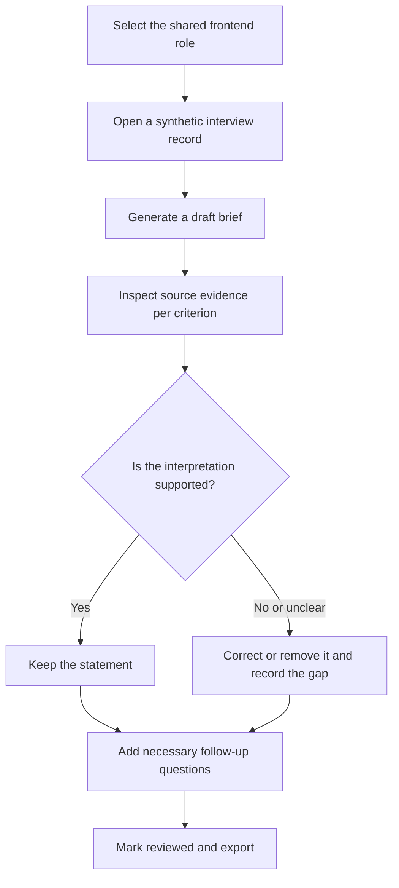

> Historical design before the September 10 evidence revision. Retained for baseline provenance; follow [current progress](../../../../README.md).

# Phase 1 decision: a reviewable first-screen brief

Decision ID: D01. Date: 2026-09-07. Status: selected for the sprint under explicit research limitations.

[Phase 1 progress](../../../../hr-product-sprint/phases/01-discovery-and-ux.md) · [Reviewer packet](../../../../hr-product-sprint/evaluation/practice/reviewer-packet.md) · [Current-product baseline](../../../../hr-product-sprint/evaluation/current-product-baseline.md)

## Decision

Use the existing InterviewMate application to prototype the work from **a completed first-screen transcript to a recruiter-reviewed brief** for one fictional mid-level frontend-engineer role.

The primary user prepares feedback for an engineering hiring manager. The unit of work is one interview brief. The intended benefit is less effort locating, interpreting, and checking evidence while preparing that brief. The sprint will not infer applicant suitability from names, personality, appearance, or voice presentation.

The problem's prevalence, urgency, and commercial value remain unvalidated. The user chose desk research because direct recruiter access is unavailable. The evidence and source limitations are recorded in the [source register](../../../../hr-product-sprint/research/source-register.md) and [problem/workflow study](../../../../hr-product-sprint/research/problem-and-workflow.md).

## Why this problem was selected

This is a qualitative decision, not a scored market-sizing exercise.

| Candidate problem | Connection to existing product | Five-day feasibility | Decision |
|---|---|---|---|
| Reduce effort preparing and checking first-screen feedback | Existing transcripts, evaluator, reports and exports directly cover the task | Can isolate one role and test source-grounding with synthetic records | Selected: strongest fit between reusable code, inspectable behavior and handoff evidence |
| Remove scheduling work through a fully autonomous voice screen | Existing interview engine and public candidate links | End-to-end readiness, devices, credentials and candidate experience create several dependencies | Keep as future/input capability; scheduling time is outside this sprint's measured benefit |
| Improve automated resume matching | Existing deterministic ATS checker | Known keyword defects and a different reference-label problem expand scope | Deferred; do not combine resume fit and interview evidence into a new universal score |

Existing tools already offer AI interview notes and links to source material. This sprint demonstrates a focused implementation and evaluation, not a claim to have invented transcript-grounded feedback. Adoption would still require proving the task matters and that the workflow fits the recruiter's current tools.

## User journey and friction to investigate

| Moment | Current task / likely question | Desired interaction | Evidence status |
|---|---|---|---|
| Before review | What is this role actually asking us to assess? | Show a shared role framework beside the interview | Existing source guidance supports shared criteria; our four criteria are provisional |
| Find evidence | Where did the candidate describe this? | Open the exact source turn from a draft claim | Current report separates narrative from transcript; effort severity unmeasured |
| Interpret evidence | Does this example support the conclusion? | Separate self-reported facts from interpretation | Design response to a known reasoning failure mode; efficacy unmeasured |
| Resolve gaps | Was this not discussed, uncertain, or contradicted? | Show the evidence limitation and a relevant follow-up | Hypothesis tested through authored practice cases |
| Handoff | What did the recruiter actually verify or correct? | Save reviewer edits and a clear reviewed state | Current inspected report has no such controls |

Do not describe these as observed participant emotions or quote a fictional recruiter. They are task hypotheses derived from desk research and code inspection.

## Primary workflow to design in Phase 2

A draft must not display as reviewed simply because generation succeeded. The designer should distinguish input validation, generation, draft readiness, source inspection, editing, failure/retry and reviewed export. The exact screen structure and data contract are Phase 2 work.

## Scope commitments

AI transforms unstructured answers into a draft and surfaces unanswered criteria. Deterministic checks should verify citation existence and output shape; human review determines whether an interpretation is justified. A valid quotation alone does not prove the conclusion drawn from it.

Use job-related evidence. Personality, accent, appearance, name and generic confidence are not assessment signals for this sprint. Technical criteria remain provisional until practitioner review; the demo cannot validate actual job competence.

### Required for the core demonstration

- One synthetic frontend role with four provisional evidence criteria: implementation/data flow, debugging, verification/testing, and accessible interfaces.
- Five shared interview questions for practice inputs; no numeric hiring score is required to demonstrate the product value.
- Synthetic transcript selection/input and a clear indication of where it came from.
- A brief showing criterion, supporting quotation/turn, interpretation, evidence limitation, and suggested follow-up.
- Recruiter correction/removal, reviewer note, and a reviewed state distinct from the AI draft.
- An export that preserves the reviewed content and source references.
- A reproducible set of behavioral examples, errors and evidence checks.

### Optional only after the core path works

- An existing voice/text interview used to create the transcript.
- Persistent role reuse and report history, if they fit the confirmed architecture/timebox.
- Visual polish that improves source inspection or correction.

### Deferred

Resume ranking, coding/whiteboard evaluation, GitHub enrichment, automated rejection, bulk candidate comparison, new ATS integrations, additional languages/roles, real applicant use and production rollout.

## Product learning and measurement boundaries

| Question | Evidence we can collect | What it cannot establish |
|---|---|---|
| Does the existing report make its evidence traceable? | Reproducible source inspection of the schema and inspected report page | Live data security, actual hallucination frequency or user effort |
| Can the proposed brief express a realistic case without overclaiming? | Source-annotated synthetic practice records and a documented walkthrough | Independent practitioner agreement or real candidate ability |
| Is the implemented AI brief grounded and consistent? | Future Phase 4 generated outputs, checks and human review | Population-level hiring validity |
| Does the workflow save human effort? | Timed manual/assisted tasks including checking, correction and export | Scheduling reduction or total time-to-hire |

No human timing has been collected. [The study guide](../../../../hr-product-sprint/evaluation/manual-study-guide.md) assigns a task to a future available human reviewer, provides a stopping rule and raw log, and keeps this measurement explicitly pending. A baseline audit of code capabilities is a separate engineering proxy, not a substitute for recruiter time.

## Handoff decisions and open questions

| Item | State entering Phase 2 |
|---|---|
| Reuse existing product | Selected |
| Primary bottleneck | Preparing and verifying interview feedback; target-user severity unvalidated |
| Role and input language | Fictional mid-level frontend engineer; English |
| Core evidence criteria | Four provisional criteria in the reviewer packet; anchors still need design/calibration |
| Main demo input | Saved synthetic transcript; voice optional after verification |
| Human decision | Recruiter owns interpretation, corrections and subsequent recruiting actions |
| Missing evidence | Must remain distinct from evidence of inability |
| Interviewer assertions | Cannot stand in for a candidate answer |
| Number of model calls / exact prompt / schema | Unresolved; Phase 2 must specify |
| Storage and authentication for synthetic demo | Unresolved; prefer the smallest dependable path |
| Real workflow fit and willingness to adopt | Future direct research |

Phase 2 should produce a concrete UX/AI specification for this scope. If research later shows the target user's biggest problem is elsewhere, record the new evidence and change the decision rather than expanding the feature set to cover every possibility.

Update, 2026-09-08: [D02](002-review-brief-design.md) resolves these design questions for the local synthetic prototype. The table above preserves the state entering Phase 2; current behavior is specified in the [design package](../design/README.md).

## Five-day scope

| Phase | Eight-hour planning allocation | Output |
|---|---|---|
| 1 | Evidence review 2h; workflow/alternatives 2h; scope 1h; baseline preparation/rehearsal 2h; synthesis 1h | Discovery package and executable measurement plan |
| 2 | Criteria/questions 2h; UX states 2h; AI/data contract 2h; test expectations 2h | Behavior spec and wireframes |
| 3 | Stabilization 2h; core report flow 4h; demo preparation/verification 2h | Runnable synthetic demonstration |
| 4 | Case runs 2h; quality review 2h; human timing 1h; fixes/retests 3h | Raw results and documented iteration |
| 5 | Case study 3h; engineering handoff 2h; recording/review 3h | Submission package |

These are proposed timeboxes, not elapsed work. Defer ATS scoring, GitHub enrichment, coding/whiteboard tools, multiple roles/languages, ATS integration, broad visual redesign, and production rollout. Existing authentication/data-access issues must be addressed if the chosen demo path depends on them; real candidate use remains outside the sprint.
