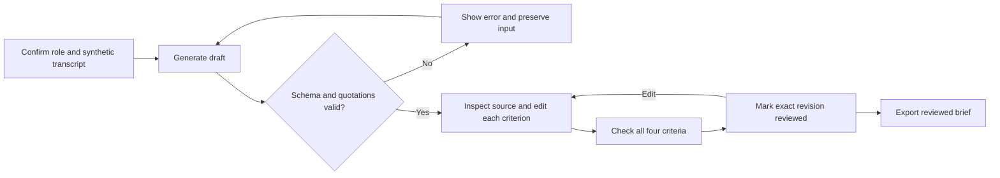

> Historical design before the September 10 evidence revision. Retained for baseline provenance; follow [current progress](../../../../README.md).

# Review Brief: UX and interaction specification

[Design package](README.md) · [Clickable wireframe](../../../../hr-product-sprint/design/wireframe.html) · [AI/data contract](ai-contract.md)

Version: `review-brief-v1`. Updated: 2026-09-07. Selected design for one local synthetic workflow; not usability-tested with a recruiter.

## Job and primary journey

Help a recruiter turn a completed screen into a brief they can inspect, correct and hand off. The unit of progress is a checked criterion, not a candidate score.

## Screen 1: prepare input

Header: “Review Brief” with “Synthetic demo” and the fixed role name. Show four criterion labels and an expandable role/question guide. The recruiter confirms “Use these role criteria” before generating.

Offer a bundled case selector (P1-A/P1-B) and “Import synthetic transcript JSON.” Show transcript ID/version, turn count, candidate/interviewer/unknown counts, and the complete source text. Require the imported record's synthetic label; never imply the app detects real versus synthetic data. Keep validation errors beside the relevant control and focus the first error on submission.

Primary action: “Generate draft.” Disable until role confirmed and input valid. Missing provider configuration produces an actionable server error. The separate authored wireframe uses “Load authored draft”; the real UI must not silently substitute it for generation.

Before work starts: “This local demo keeps your work in this tab. Export the reviewed brief before closing.” Changing a case, role/input version or importing new text discards the current generation/review after an explicit discard action. A canceled switch preserves the work.

## Screen 2: review with source visible

Desktop: left column has four criterion cards; right column has the full transcript. Each card contains:

1. Criterion ID/name and a textual evidence status.
2. Up to three concise cited claims. Source buttons display the turn ID; quotation text is read-only.
3. “What remains unclear” (limitation) and “Suggested follow-up.”
4. “Edit,” “Remove claim”/“Restore claim,” and a checkbox: “I checked this criterion against the source.”

Clicking a citation reveals the source turn, highlights its exact quotation and includes surrounding turns. Preserve the full turn so missing qualifiers are discoverable. For multiple matching occurrences within one turn, highlight all exact matches; the full turn is authoritative. A “Return to claim” action restores keyboard focus. A conflict exposes both candidate turns equally.

Do not color statuses as hire/reject signals. All four statuses use a label and neutral/attention treatment. “Not established” explains “This record does not establish the criterion.” A material limitation remains visible even beside “Specific evidence.”

Editing opens labeled fields for claim text, evidence status, limitation and follow-up. Quote/turn fields stay read-only. “Save changes” validates current shape and source references, resets that criterion's checked state and exits global reviewed state; “Cancel” retains the saved revision. Removal is undoable. A status requiring evidence cannot be saved with zero claims; choose “Not established” and explain the limitation instead.

The shared reviewer note records process/next steps, not uncited new findings. Show a live “N of 4 criteria checked” counter. A checkbox represents the reviewer's attestation; opening a source or generating a draft never checks it automatically.

## Screen 3: reviewed brief and export

“Mark reviewed” is available only after four checks, valid current content and a reviewer ID (1–80 nonblank characters). It captures the exact revision and review time, then shows “Reviewed by [ID]” and “Export JSON” / “Export text.” “Reviewed” means inspected, not suitable for hiring; conflicts may remain explicitly unresolved.

The export preserves evidence, limitations, follow-ups, synthetic/provenance labels and reviewer edits. JSON includes the input and original AI draft; see the [export contract](ai-contract.md#reviewer-state-and-export). No emailing, sharing or candidate action is triggered. Editing afterward invalidates the reviewed revision and disables export until rechecked.

## State and error behavior

| State | Visible content / action | Preservation rule |
|---|---|---|
| Empty | Choose/import a synthetic transcript; role guide | No invented result or empty score |
| Invalid input | Field-specific explanation and limits | Retain entered JSON for correction |
| Ready | Source preview and enabled Generate draft | Confirmation bound to current role version |
| Generating | “Drafting evidence…” plus Cancel; one pending attempt | Input/source remain readable; prevent duplicate generation |
| Draft | Criteria and linked source, all checks initially off | Original draft immutable |
| Editing | Labeled fields, Save/Cancel and character counts | Unsaved field changes do not change saved content |
| Failed generation | Error, explicit Retry, access to original input | Existing same-input draft retained and labeled as previous; no partial new report |
| AI unavailable | Explain configuration/model problem | No simulated live success |
| Reviewed | Reviewer/revision label and export controls | Any later content edit clears reviewed state |
| Leaving with edits | Warning to export before closing | Cancel navigation keeps work; refresh otherwise clears memory |

Server error codes and recovery actions are fixed in the [AI contract](ai-contract.md#api-envelope-errors-and-provenance). Do not display raw provider exception text or credentials. Cancellation and late responses cannot overwrite a newer input/draft.

## Layout and tokens

Reuse the existing [theme tokens](../../../../../src/app/globals.css). The wireframe uses the light palette for readable annotation; production theme behavior is inherited from the application. Proposed spacing/layout aliases are local to Review Brief.

| Token | Value / source | Use |
|---|---|---|
| `--rb-page-max` | 1,200px | Content max width |
| `--rb-space-1/2/3/4/6/8` | 4/8/12/16/24/32px | Spacing scale |
| `--rb-control-min` | 44px | Pointer/keyboard controls |
| `--rb-grid-gap` | 24px | Column/card separation |
| `--rb-text` | `--color-neutral-900` in light theme | Body text |
| `--rb-surface` | `--surface` | Cards and source panel |
| `--rb-action` | `--color-primary-700` | Primary action and focus emphasis |
| `--rb-border` | `--border` | Decorative separators; controls need stronger visible boundary |
| `--rb-radius` | `--radius-lg` | Cards and panels |
| `--rb-motion` | `--transition-fast` (150ms) | Hover/focus transitions only |

Use inherited sans/heading families. Body text is 16px/1.5; annotations 14px/1.5; main heading 28px/1.2, weight 600. Avoid essential 12px text, shadows behind long source text or decorative motion.

At 1,024px and above use a 3:2 review/source grid, page padding 32px and a sticky source panel below the header. At 768–1,023px use one column with an inline source disclosure under the selected claim. Below 768px use 16px page padding, stacked actions and the same source disclosure. At 320px and at 200% zoom, text/actions wrap without horizontal page scrolling.

## Component handoff

| Component | Main props/state | Responsibility |
|---|---|---|
| RoleAndInput | role, input, confirmedRoleVersion, errors | Confirm framework, select/import and preview source |
| GenerationStatus | attemptId, state, error | Busy, cancel and explicit retry |
| CriterionReview | criterionId, original/current entry, checked | Evidence rendering, edits/removal and review attestation |
| SourcePanel | turns, active citations, return-focus target | Context, exact highlights and navigation |
| ReviewFooter | flags, reviewerId, note, revision, reviewedRevision | Eligibility, mark reviewed and export |
| ProvenanceLabel | sourceType, transcript/version, model/role/prompt versions | Separate authored examples from live output |

## Content, accessibility and motion

Use the [contract limits](ai-contract.md#draft-contract-and-validation) in visible character counters and validation. Never truncate source text or a material qualifier; collapse long source context with an explicit Show more action. Long IDs/words wrap. English is the only assessed language for this sprint; preserve imported characters as data and do not silently translate.

Use semantic headings, buttons, labels, native checkbox/select/textarea controls, a skip link and a visible focus ring. Focus order follows role/input → generate/status → criterion cards → source → reviewer/export. On narrow screens, the source disclosure follows its citation in DOM order. Escape closes edit/source overlays and returns focus; no keyboard trap.

Announce generation completion and review-count changes through a polite live region. Use an alert for errors with field associations. Focus the first failed field after validation; do not repeatedly announce the full transcript. Status is communicated by text, not color. Validate text and control contrast during Phase 3; this specification does not claim an accessibility audit passed.

Hover/active states change the action tone; disabled controls retain readable labels plus an adjacent reason. No swipe or drag gesture is required. Honor prefers-reduced-motion by removing transitions and smooth scrolling.
