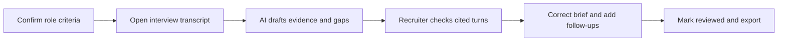

# Phase 1: discovery and UX workflow

Status: **Desk-research discovery package complete; human timing baseline pending.**

Started / last updated: 2026-09-07 (Asia/Jakarta). Planned allocation: 8 hours. [Sprint index](README.md) · [Next phase](02-solution-design-and-ai-logic.md)

## 1. Discovery decision

Explore **evidence-backed first-screen review** using the existing InterviewMate AI application. Focus on the work between a completed interview transcript and a brief ready for a hiring manager.

Working problem statement:

> A recruiter reviewing a frontend-engineer screen needs to turn candidate answers into a concise, job-specific brief. Reconstructing evidence, identifying unanswered criteria, and checking AI claims may make this handoff slow or unreliable. We will test whether a draft with traceable evidence reduces that review effort without reducing quality.

This is a research-informed hypothesis, not a finding from an interviewed customer. The user confirmed on 2026-09-07 that recruiter/hiring-manager access is unavailable and requested desk research first. Direct interviews are a future opportunity, not a prerequisite for starting the prototype.

## 2. Target user and job to be done

| Element | Working definition | Evidence status |
|---|---|---|
| Primary user | A tech recruiter who prepares first-screen feedback for a hiring manager | Proposed segment |
| Scenario | One mid-level frontend-engineer vacancy; several synthetic candidates evaluated against the same role criteria | Scope choice, not a real vacancy |
| Secondary user | Engineering hiring manager reading and questioning the brief | Proposed downstream user |
| Affected participant | Candidate whose words may be summarized incorrectly or whose answer may be missing | Product risk to test |
| Existing tools | Interview notes/transcript plus a scorecard or document; existing AI note tools are also alternatives | Supported as available workflows; actual target-user usage unknown |
| Desired outcome | A brief the recruiter can verify, correct, and hand off with clear unknowns | Product hypothesis |

Job to be done: **When I finish a candidate screen, help me organize what was actually demonstrated against the role criteria, so I can prepare the next conversation without re-reading the entire interview or trusting an unexplained score.**

We have no defensible estimate yet for applicant volume, review minutes, salary impact, willingness to pay, or the prevalence of this bottleneck in Indonesian or global tech recruiting. Avoid invented persona names, interview quotations, and workload percentages.

## 3. Evidence register

Evidence labels: **External** = a cited source reports it; **Code** = observed in this repository; **Hypothesis** = a proposition to test; **Proposed** = our design choice; **Measured** = an actual recorded study/run. An offline source inventory has now been executed; there are no measured user outcomes or prototype AI-quality results yet.

All external sources below were accessed on 2026-09-07. Dates are publication/update dates visible on the source, where available.

| ID | Source and date | Supported finding | Limit and implication |
|---|---|---|---|
| E01 | [OPM: Structured Interviews](https://www.opm.gov/policy-data-oversight/assessment-and-selection/structured-interviews); page date not shown | Structured interviewing uses job-related competencies, shared questions, and common rating standards. | US federal assessment guidance supports a design principle; it does not validate our AI or this segment's pain. Use a common role framework. |
| E02 | [Greenhouse: Scorecard definitions](https://support.greenhouse.io/hc/en-us/articles/360007247412-Structured-hiring-Scorecard-definitions); updated 2022-07-08 | A role scorecard defines what interviews should examine; Greenhouse advises keeping the attributes concise and relevant. | Vendor workflow guidance, not a productivity study. Draft a small set of explicit criteria before generating a report. |
| E03 | [Greenhouse: Scorecard feedback report](https://support.greenhouse.io/hc/en-us/articles/203941419-Scorecard-feedback-report); updated 2026-03-02 | Existing recruiting software supports analysis of ratings by candidate, stage, interviewer, and job. | Establishes an existing workflow; does not demonstrate how often our user suffers inconsistency. Avoid claiming that scorecards themselves are novel. |
| E04 | [Greenhouse: Notetaker](https://support.greenhouse.io/hc/en-us/articles/50523570982939-Use-Greenhouse-Notetaker-to-record-and-summarize-interviews); updated 2026-08-19 | Per-question AI notes link to transcript moments, and the workflow encourages the interviewer to contribute an assessment. | Direct overlap with our concept. Traceable AI summaries are an existing capability, not an original market claim. |
| E05 | [Greenhouse: Summarize scorecards using AI](https://support.greenhouse.io/hc/en-us/articles/44504659750299-Summarize-scorecards-using-AI); updated 2026-04-03 | AI summaries can link key points to original scorecards and distinguish agreement from disagreement. | This aggregates scorecards, a different input from our single transcript. Useful adjacent pattern, not proof of our performance. |
| E06 | [Metaview: What 5.2M interviews reveal about scorecard completion](https://www.metaview.ai/resources/blog/ai-scorecard-completion-rate-study); published 2026-06-26 | In its reported observational comparison, submission was 28.6% for interviewer-written scorecards (26,498) versus 50.3% for Metaview-drafted scorecards (93,502). | Vendor corpus, nonrandomized groups, possible process differences. This association motivates testing drafting burden; it cannot establish causality, our baseline, or industry-wide prevalence. More filled fields do not establish better evidence. |

Synthesis: external evidence establishes structured feedback as a real recruiting activity and AI drafting as an existing product category. It provides a reason to investigate this workflow. It does **not** establish that a particular recruiter needs another tool, that transcript review is their largest bottleneck, or that InterviewMate will save time.

## 4. Existing alternatives and product implication

| Alternative | What it already addresses | Question our sprint must answer |
|---|---|---|
| Manual role scorecard and notes | Explicit criteria and human judgment | Does AI assistance reduce preparation/review effort at comparable quality? |
| Existing InterviewMate report | Immediate scores, evidence text, summary, and transcript export | Does a traceable, editable brief improve on this existing report? |
| Greenhouse Notetaker / AI scorecard summaries | Drafting and links to original information [E04, E05] | Can a small, testable prototype demonstrate a coherent version of the workflow? |
| Metaview-assisted scorecard workflow | AI draft followed by human review [E06] | What remains difficult after a draft is available? We do not yet know. |

The sprint's contribution is a documented product decision and evaluated implementation within InterviewMate. We are not claiming a new category or superiority over these tools. An ATS integration would matter for adoption, but is outside this five-day build.

## 5. Current workflow map

The manual workflow below is reconstructed from sources and product reasoning, not observed with a participant.

| Step | User activity and artifact | Potential friction | Basis |
|---|---|---|---|
| 1. Align on role | Recruiter and manager define interview criteria | Vague criteria make feedback difficult to compare | E01/E02 plus inference |
| 2. Conduct screen | Ask questions; produce notes or a transcript | Missing follow-ups may leave important evidence absent | Hypothesis |
| 3. Reconstruct answers | Review notes/transcript after the screen | Searching and remembering may take effort | E06 reports this concern; target-user severity unknown |
| 4. Complete feedback | Map answers to criteria and write a brief | Generic praise, unsupported inference, or blank criteria | Hypothesis to test with synthetic cases |
| 5. Handoff | Manager reads the brief and requests clarification | Ambiguous claims may cause a second review | Hypothesis |

The existing app's source implements this path:

`Recruiter enters role + candidate + PDF + time window → generates candidate link → candidate enters interview room → conversation produces transcript → AI generates report → recruiter reads or downloads report`

| Code observation | UX consequence / opportunity | Repository evidence |
|---|---|---|
| Creation collects role/JD, questions, candidate details, PDF and dates; a new template is written for each session | Repeated candidate setup can repeat role preparation. A reusable role configuration is worth exploring. | [CreateInterviewModal](../../src/components/dashboard/CreateInterviewModal.tsx), [interview persistence](../../src/lib/firebase/interviews.ts) |
| Reports show scores, pass/fail, free-text evidence and transcript separately; inspected page has no correction/review controls | Recruiter must manually reconcile claims and source text. This is the selected product gap. | [Report page](../../src/app/(recruiter)/interviews/[sessionId]/page.tsx) |
| Evaluator requires numeric scores and at least one strength and weakness; has no transcript citation IDs or insufficient-evidence state | Sparse answers can be pushed into overly definite reports. The schema needs an explicit way to report unknowns. | [Evaluation endpoint](../../src/app/api/evaluate/route.ts) |
| Interview list can sort by score; dashboard shows recent sessions | Basic pipeline UI is reusable. Do not claim a validated job-level shortlist or ranking algorithm. | [Interview list](../../src/app/(recruiter)/interviews/page.tsx), [dashboard](../../src/app/(recruiter)/dashboard/page.tsx) |
| Interview connection expects a key in the browser; candidate entry and session timing have separate steps | Fresh-browser candidate onboarding needs a live check before depending on voice in the demo. | [Interview store](../../src/lib/store/useInterviewStore.ts), [candidate entry](../../src/app/(public)/apply/[sessionId]/page.tsx) |

These are source observations. The prior review did not complete a live interview/Firebase round trip. Four arithmetic tests passed, TypeScript/lint failed, and default local development encountered Tailwind resolution errors. Track repair and verification in Phase 3, not as demonstrated product readiness.

## 6. Hypotheses and what would change our mind

| ID | Hypothesis | How to investigate | Evidence against it |
|---|---|---|---|
| H01 | Preparing usable post-screen feedback is a meaningful task for the target user | Desk evidence now; later a recent-example interview and observed task | Recruiter reports feedback is already quick or someone else owns it |
| H02 | Traceable drafts reduce total review effort | Compare manual and assisted completion on comparable synthetic inputs | Verification/correction takes as long as manual work |
| H03 | Explicit missing-evidence states reduce unsupported conclusions | Test sparse and incomplete transcripts against authored expectations | Report invents evidence or reviewer mistakes unknown for poor performance |
| H04 | One shared role framework improves comparability | Apply the same criteria to every synthetic case and inspect decisions | Criteria do not fit the role or different questions make results incomparable |
| H05 | A focused brief fits the handoff workflow | Later ask a manager to use it to prepare follow-ups | Extra export/copying or duplicate tools cost more effort than the brief saves |

Scope-changing findings: if feedback preparation is not painful, reconsider the problem before expanding features. If voice is unreliable, demonstrate transcript-to-brief as the core workflow. If evidence cannot be grounded reliably, keep the prototype exploratory and report the failure rather than presenting scores as dependable.

## 7. Near-future concept and UX boundary

Proposed concept: **InterviewMate Review Brief**. The recruiter confirms a role framework, opens a transcript, and receives a draft with criterion-specific evidence and questions that still need answers. Every factual candidate claim points to an exact source turn. The recruiter can correct or remove it, add a note, and mark the brief reviewed before export.

AI contribution: transform unstructured answers into a structured draft and surface unanswered criteria. Deterministic checks should verify citation existence and output shape; human review determines whether an interpretation is justified. A valid quotation alone does not prove the claim drawn from it.

Proposed boundaries:

- Synthetic data only for this sprint. No real applicants or external recruitment actions.
- One frontend role, one language (English), a shared small criterion set, and five core questions.
- Retain the existing interview as a possible input; provide a saved-transcript route for repeatability.
- Separate missing evidence from evidence of a gap. Never interpret silence as proof of inability.
- Use job-related evidence. Avoid personality, accent, appearance, name, and generic confidence as scoring signals.
- Preserve recruiter judgment and record corrections. No automatic candidate rejection.
- Make technical criteria provisional until reviewed by a hiring-domain practitioner; the demo cannot validate actual job competence.

## 8. Synthetic discovery example

**Illustration authored by the project AI assistant; not a user interview, prototype-evaluator output, measured benchmark, or validated rubric.** This short fragment explores what an inspectable brief should contain. It is too short for a representative timing study. The longer [reviewer packet](phase-1/reviewer-packet.md) now supplies two practice records with a separate [reference guide](phase-1/reference-notes.md).

Role context: a frontend engineer builds web interfaces, investigates defects, and explains testing choices.

| Turn | Speaker | Exact text |
|---|---|---|
| T01 | Interviewer | Tell me about a frontend defect you investigated and what you did. |
| T02 | Candidate | The search results sometimes showed an older query. I reproduced it by typing quickly, saw requests finishing out of order in the network panel, and changed the component to ignore responses from earlier requests. |
| T03 | Interviewer | How did you check the change? |
| T04 | Candidate | I tested rapid typing manually. I have not added an automated regression test yet. |
| T05 | Interviewer | What accessibility checks did you run? |
| T06 | Candidate | We did not discuss accessibility in that task, and I cannot give you an example from it. |

Expected interpretation for exploration:

- Debugging: T02 supports a self-reported example of reproduction, diagnosis, and a proposed fix. It does not independently prove the fix worked in production.
- Testing: T04 supports manual checking and explicitly states the lack of an automated regression test for that change. It does not prove that the candidate cannot write tests.
- Accessibility: this example does not establish accessibility competence. Ask for a separate example; do not infer poor overall ability from T06.

Result of this reasoning exercise: the brief needs separate fields for source quotation, interpretation, evidence status, and follow-up. Requiring a strength and weakness for every input would not represent this fragment cleanly. The prototype evaluator was not run on this example.

## 9. Baseline definition and measurement plan

**Primary baseline: active human minutes required to produce a reviewable brief from a supplied transcript. Current value: Not measured.**

This compares post-screen work only. Interview duration, scheduling time, and total time-to-hire are outside the metric. Record machine waiting time and task elapsed time separately so faster generation is not mistaken for faster human review.

Manual task: given the same role criteria, transcript format, and blank brief, read the interview, extract evidence, mark unknowns, and write follow-ups. Stop when the brief passes the same completeness/quality checklist used for the assisted condition.

Assisted task: load the material, generate the draft, check every cited claim, fix errors, mark unknowns, and finish the brief. Include verification, editing, and export effort; do not time only the API response.

Protocol to execute later:

1. Use the two completed Phase 1 practice records to rehearse the procedure. Finalize the role framework and author eight separate Phase 4 cases before model testing; keep author/reference bias explicit. Practice records and their assistant-authored references are never held-out evaluation data.
2. Use a human reviewer. If this is the project creator, label it a creator-run usability rehearsal, not recruiter validation. Agent execution speed cannot substitute for human timing.
3. Use matched case sets and alternate manual/assisted order to reduce learning effects. With two reviewers, reverse assignments so each case appears in both conditions without immediate repeat exposure. Record any reuse and familiarity.
4. Fix the environment, task instructions, brief template, and stopping criteria. Log interruptions and failed tasks; exclude none silently.
5. Record per-case raw durations and quality counts before reporting medians/ranges. Treat a small sample as exploratory.
6. Revisit the direction if assisted verification removes the time advantage or quality declines.

| Measure | Definition | Current result |
|---|---|---|
| Manual active minutes | Reading + evidence extraction + writing + final checking | Not measured |
| Assisted active minutes | Setup + source verification + corrections + final checking | Not measured |
| Elapsed minutes | Start-to-finish time including generation/waiting | Not measured |
| Unsupported-claim rate | Unsupported factual candidate claims / all factual candidate claims in brief | Not measured |
| Missing-evidence handling | Correctly flagged expected-unknown criteria / expected-unknown criteria | Not measured |
| Correction burden | Substantive claim corrections and removals per brief | Not measured |

Raw log template: `date, reviewer_id, reviewer_background, case_id, condition, order, role_version, prompt_version, model_id, active_seconds, wait_seconds, elapsed_seconds, claims_total, unsupported_claims, expected_unknowns, correctly_flagged_unknowns, substantive_edits, task_completed, interruptions, notes`.

The executable study materials are the [facilitator guide](phase-1/manual-study-guide.md), [participant packet](phase-1/reviewer-packet.md), [blank brief](phase-1/blank-review-brief.md), and [header-only human timing log](phase-1/baseline/human-review-log.csv). The guide adds fields for prior exposure and tools used. No human participant is assigned; this empirical measure remains explicitly pending in Phase 4.

### Separate current-product capability baseline

The [offline source audit](phase-1/current-product-baseline.md) ran against the existing evaluator, scoring helper and report page. Its [recorded JSON](phase-1/baseline/current-product-audit.json) includes source hashes and line references:

| Source-level measure | Observed starting value | Proposed improvement to design |
|---|---|---|
| Structured evidence-item collections | 0 of 3; all three contain strings | Separate criterion, quotation and source-turn fields |
| Required numeric dimensions | 7 nonnullable numbers | Explicit evidence limits; numeric scoring only if justified |
| Required strength/weakness entries | At least 1 of each | Permit an honest report when evidence is insufficient |
| Native editing controls in the inspected report | 0 | Recruiter correction and removal |
| Separate human-review workflow in the inspected report | None found in manual source review | A reviewed state distinct from AI evaluation |

These are actual source-inventory observations. They are not measurements of recruiter time, AI hallucination frequency, hiring accuracy, or fairness. A free-text evidence string may contain a quotation; the audit shows that its citation is not a separate structured field. The script's scope and limitations are documented with the baseline.

A speed improvement, when measured, is `(manual median - assisted median) / manual median * 100`, only for comparable conditions with nonzero manual time. Report the raw data and quality measures alongside it. Do not reuse the old project's percentages as a baseline.

## 10. Five-day scope

| Phase | Eight-hour planning allocation | Output |
|---|---|---|
| 1 | Evidence review 2h; workflow/alternatives 2h; scope 1h; baseline preparation/rehearsal 2h; synthesis 1h | This discovery document and an executable measurement plan |
| 2 | Criteria/questions 2h; UX states 2h; AI/data contract 2h; test expectations 2h | Behavior spec and wireframes |
| 3 | Stabilization 2h; core report flow 4h; demo preparation/verification 2h | Runnable synthetic demonstration |
| 4 | Case runs 2h; quality review 2h; human timing 1h; fixes/retests 3h | Raw results and documented iteration |
| 5 | Case study 3h; engineering handoff 2h; recording/review 3h | Submission package |

These are proposed timeboxes, not elapsed work. Defer ATS scoring, GitHub enrichment, coding/whiteboard tools, multiple roles/languages, ATS integration, broad visual redesign, and production rollout. Existing authentication/data-access issues must be addressed if the chosen demo path depends on them; real candidate use remains outside the sprint.

## 11. Future direct-research guide

Use only if access becomes available; do not send outreach without user authorization. A short conversation can improve this draft, but cannot establish population-level conclusions.

1. Walk me through your most recent first-screen handoff. Who wrote it, and who used it?
2. What did you have in front of you: notes, transcript, recording, scorecard, or something else?
3. Which part required the most work? What happened the last time feedback was incomplete?
4. How do you distinguish an unanswered topic from weak evidence?
5. What makes you reopen a transcript or ask the interviewer for clarification?
6. Which existing tools already solve this? What still requires manual checking?
7. What would make an AI draft unusable or slower to review?
8. After discussing current behavior, show the concept and ask them to find and correct one unsupported claim.

Capture anonymized observations, exact quotations only when actually recorded, workarounds, contradictory evidence, and follow-up questions. Prefer a synthetic example over collecting real candidate information.

## 12. Progress and exit criteria

- [x] Establish desk research as the agreed discovery method.
- [x] Define a provisional user, problem, and job to be done.
- [x] Review primary sources with limitations and existing alternatives.
- [x] Map the existing app and hypothesized manual workflow.
- [x] Set a narrow concept and five-day scope.
- [x] Define baseline measures and a comparison protocol.
- [x] Explore one explicitly synthetic example.
- [x] Prepare two realistic practice records, separate source annotations, a blank brief, task instructions and an empty raw timing log.
- [x] Record a reproducible current-product capability inventory, clearly separate from human timing and AI-quality evaluation.
- [x] Resolve the discovery scope and hand the decision into Phase 2 through [D01](phase-1/decision-and-scope.md).
- [ ] Collect an empirical human timing baseline. No participant is assigned; this outstanding evidence is tracked in [Phase 4](04-evaluation-and-iteration.md), not marked complete.

Decision confidence: sufficient to begin a small design experiment; insufficient to claim validated demand, time savings, hiring accuracy, or reduced bias. The desk-research discovery package is complete and ready for Phase 2. The requested empirical human baseline remains outstanding; the source-level baseline does not replace it. Lack of recruiter access does not block detailed design under these limitations.

## 13. Completed discovery artifacts and verification

| Artifact | Purpose / result |
|---|---|
| [Decision and scope](phase-1/decision-and-scope.md) | Compares three candidate problems and records the selected workflow, scope, dependencies and Phase 2 questions |
| [Reviewer packet](phase-1/reviewer-packet.md) | Fixed fictional role, four provisional criteria, five core questions, and two practice transcripts |
| [Reference notes](phase-1/reference-notes.md) | Source annotations kept separate from participant materials; permissible interpretations, unsupported conclusions and follow-ups |
| [Blank review brief](phase-1/blank-review-brief.md) | Common output template for manual and later assisted tasks |
| [Facilitator guide](phase-1/manual-study-guide.md) | Timing boundaries, completion rule, quality checks, debrief and limitations |
| [Human timing log](phase-1/baseline/human-review-log.csv) | Header only; no fabricated session data |
| [Current-product baseline](phase-1/current-product-baseline.md) | Actual source inventory and manual interpretation, with reproducible script and raw JSON |

Packet verification: P1-A has 14 turns and 643 transcript words; P1-B has 14 turns and 673 words, counting interviewer questions and candidate answers. All 28 quoted snippets checked in the reference guide occur in the cited candidate turns. Source quotations and interpretations were also read for context; the notes preserve self-report, testing limits and the ownership contradiction. This is an internal artifact check, not recruiter agreement or a live model-evaluation result. Similar length does not establish equal review difficulty.

## 14. Progress log

| Date | Progress | Evidence / next action |
|---|---|---|
| 2026-09-07 | Reviewed the existing product and historical planning context | Reuse the interview/report foundation; keep this sprint distinct from legacy phases |
| 2026-09-07 | User selected desk research | No direct user findings are claimed |
| 2026-09-07 | Documented six external sources, alternatives, workflow and hypotheses | Category is established; target-user severity remains unknown |
| 2026-09-07 | Prepared synthetic illustration, measurement protocol and scope | Next: realistic cases, human baseline when available, then detailed design |
| 2026-09-07 | Committed sprint documents on `codex/hr-product-sprint` as `0e9eba2` | Six phase/index documents saved; inherited Firebase changes excluded |
| 2026-09-07 | Prepared full Phase 1 practice and measurement materials and checked source annotations | Two synthetic practice records; no participant session or prototype evaluation run |
| 2026-09-07 | Executed source inventory and finalized D01 discovery scope | Discovery package ready for Phase 2; human timing explicitly pending |
