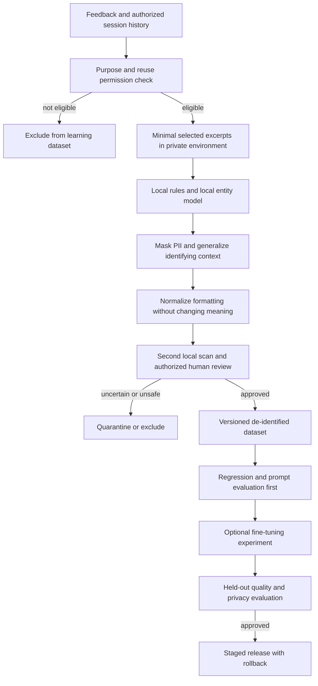

# Future improvement: feedback and privacy-aware learning

Updated: 2026-09-11. **Roadmap proposal only.** The feedback form is implemented; local PII processing, curated training datasets and fine-tuning are not. This proposal does not authorize exporting or training on existing candidate records.

[Case study / PRD](../../../deliverables/case-study-and-prd.md) · [Data governance](../evaluation/data-governance.md)

## Goal and order

Use candidate experience feedback to identify recurring product problems, turn approved examples into regression cases, and evaluate improvements before changing a production model. Start with prompt, UX and orchestration fixes. Consider fine-tuning only when reviewed examples demonstrate a repeatable problem those changes do not solve.

## 1. Enhance the existing feedback loop

The form already collects overall experience, interviewer clarity, transcription accuracy, question relevance, technical reliability and an optional comment. Proposed additions are optional issue categories and a selected question/turn reference so the team can locate the reported problem. Do not attach complete transcripts to general analytics events.

Track response rate (submitted feedback / eligible completed sessions), each metric's count and distribution, recurring issue frequency, and verified resolution rate. Show sample sizes and language/model/version when cohorts are large enough to avoid exposing individuals. Missing feedback is not a negative rating. Exclude seeded demo records from product metrics.

Candidates report their experience; their satisfaction score does not establish whether a competency score is correct. Independent reviewers must inspect quotations, rationale and rubric levels when creating evaluation labels. Past hiring decisions and AI-generated scores are not automatic ground truth.

## 2. Proposed data flow

A transcript has already been processed by cloud services in the current hosted interview flow. A later local sanitizer cannot undo that prior processing. The boundary proposed here protects **future dataset preparation/export**; it is not a claim that the existing live interview is entirely local.

## 3. Local masking and normalization

Run the sanitization worker on an operator-controlled workstation or an isolated private server. A remote Ollama endpoint is still remote processing, even if the model weights are open. If using a private cloud server, document that boundary rather than calling it on-device processing.

A small CPU entity-recognition model plus deterministic recognizers is the first implementation candidate; a large generative LLM is not required. A locally hosted LLM may assist contextual detection if resources permit, but cannot approve its own output for export. Evaluate English and Indonesian recognition separately, including code-switching and local identifier formats.

Proposed controls:

- Detect direct identifiers: names, emails, telephone numbers, addresses, account/identity numbers, URLs, GitHub handles and employer/client identifiers where identifying or confidential.
- Inspect indirect identifiers: rare project descriptions, exact dates, locations, company/role combinations and unusual incidents. Generalize or exclude passages that remain identifying.
- Replace entities with within-record placeholders such as `[PERSON_1]`, `[ORG_1]` and `[EMAIL_1]`. Avoid stable cross-record identity tokens. Exclude session IDs and identity mappings from exports; protect any necessary deletion/provenance mapping separately.
- Normalize whitespace, encoding and verified transport duplicates. Preserve speaker/turn boundaries, negation, uncertainty, chronology and technical details needed for evidence. Do not rewrite hesitant answers as confident ones or silently change numerical claims.
- Keep source-to-sanitized turn mapping in the restricted audit area. Validate dataset quotations against the sanitized text so the example and target still agree.
- Scan optional feedback comments as well as transcripts. Avoid raw audio in the initial learning dataset; a voice recording has different identification risks from text.
- Block export on processing failure, uncertain entities or unresolved review. No cloud fallback for raw sanitization inputs. Keep outbound access, logs, temporary files, access permissions and retention under explicit control.

For example, `I built the fraud dashboard at Acme with Jane; contact jane@example.com` could become `I built the fraud dashboard at [ORG_1] with [PERSON_1]; contact [EMAIL_1]`. Even that sentence may remain identifying in context; replacement alone does not prove anonymity.

Presidio is one candidate library because it supports combinations of rules and entity recognition and local execution. Its own documentation states that automated detection cannot guarantee finding every sensitive entity. Tool selection, languages and thresholds need validation before adoption. Sources: [Presidio overview](https://microsoft.github.io/presidio/), [deployment and limitations FAQ](https://github.com/microsoft/presidio/blob/main/docs/faq.md) (checked 2026-09-11).

## 4. Curated datasets and optional fine-tuning

Interview participation or ordinary feedback submission does not automatically authorize training reuse. Before inclusion, document the reuse purpose and applicable permission, provide a separate understandable choice where required, and define retention, access and withdrawal handling. Use synthetic examples first when reuse is unavailable or the source cannot be safely de-identified.

Create distinct datasets for distinct goals:

| Goal | Reviewed input and target | Evaluation |
|---|---|---|
| Better questions and interviewer behavior | Role/context, prior exchange and reviewer-approved next question | Relevance, unnecessary repetition, unsupported assumptions, no spoken planning filler |
| Better evidence extraction | Sanitized transcript/rubric and reviewer-checked quotations/levels | Quote grounding, abstention, schema validity, level agreement and subgroup/language errors |
| Better transcription | Separately governed audio/reference pairs | Word/character error and meaning-changing technical-term errors |

Text-only history does not by itself fine-tune a speech recognizer. Do not mix transcription training into the first text-evaluator experiment.

Version the dataset, sanitization policy, reviewer decisions, prompt, model and rubric. Split by source candidate/session before building train/validation/test sets, and keep duplicate or derived examples in the same split. Keep a held-out set untouched by prompt tuning and model selection. Remove leakage through names, identifiers, near-duplicate answers or reference labels in model inputs.

Compare fine-tuning against the existing model and a prompt-only baseline. Measure quality and failures alongside latency and cost; no default score improvement is assumed. Fine-tuning should target grounded behavior, not higher candidate percentages or imitation of historical hiring choices. Promotion requires explicit human approval and a rollback path.

## 5. Gates before a learning release

| Gate | Required evidence |
|---|---|
| Reuse eligibility | Documented purpose/permission and exclusion of ineligible/seeded records |
| Sanitization | Labelled synthetic PII tests in EN/ID, per-entity precision/recall and contextual identification review; no unresolved detected identifiers in an exported record |
| Evidence preservation | Review confirms masking/normalization did not change responsibility, uncertainty, technical meaning or quote alignment |
| Dataset quality | Reviewed labels, version manifest, candidate/session-separated splits and duplicate checks |
| Model quality | Held-out comparison against current/prompt-only baselines, including unsupported quotes, abstention, language errors and latency/cost |
| Model privacy | Test memorization/extraction and restricted canary examples; residual risk remains explicit |
| Lifecycle | Access/retention/deletion procedure, derived-dataset traceability and rollback/version retirement plan |

Deleting a source row does not reliably remove its influence from a trained model. Resolve the response to withdrawal before training: identify affected dataset/model versions and determine whether retraining or retiring a version is necessary. Do not promise automatic model unlearning.

Thresholds and sample sizes must be set before an experiment, based on the intended use; they are not yet measured or approved. Local processing reduces transfer exposure but still requires secure storage, logs, access control and a checked export boundary. Call the output **de-identified or pseudonymized** until a stronger anonymity assessment supports a different claim.

## MVP boundary

The current submission can describe this as a future improvement supported by an existing feedback form. No background collection, export, local model deployment or fine-tuning is enabled by documenting it. The next practical step is a small synthetic-only masking/evaluation pilot, after the current quest submission.
